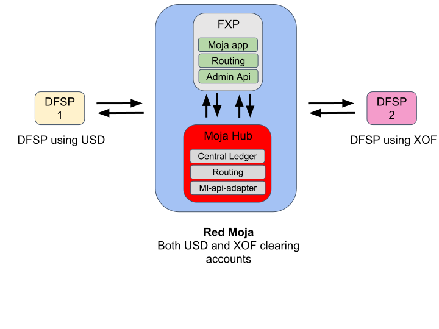

# Cross-currency POC

Alice is a customer at DFSP1 and has a USD account. Bob is a customer at DFSP2 and has an XOF account. DFSP1, DFSP2 and the FXP are registered as participants at the same Moja Hub operated in this case by Mowali. This POC outlines the flow for performing an in-network cross-currency transaction from Alice to Bob.

<!--  -->

## Setup
This section summarises the values used in setting up this POC. The instructions to set this up on a Kubernetes cluster may be found at [https://github.com/mojaloop/cross-network/blob/master/part2-johannesburg-april-2019/cross-currency-setup.md](https://github.com/mojaloop/cross-network/blob/master/part2-johannesburg-april-2019/cross-currency-setup.md).
### DFSP1
* USD account
* Address: moja.mowali.usd.dfsp1

### DFSP2
* XOF account
* Address: moja.mowali.xof.dfsp2

### FX Provider - Mojaloop app
**NB:** The ids used for the different participants registered on the FXP must be of the format **{fspId}-{currency}**
The 
<table>
<tr>
  <th></th>
  <th>Mowali USD Account</th>
  <th>Mowali XOF Account</th>
</tr>
<tr>
  <td>id</td>
  <td>mowali-usd</td>
  <td>mowali-xof</td>
</tr>
<tr>
  <td>assetCode</td>
  <td>USD</td>
  <td>XOF</td>
</tr>
<tr>
  <td>assetScale</td>
  <td>2</td>
  <td>2</td>
</tr>
<tr>
  <td>relation</td>
  <td>peer</td>
  <td>peer</td>
</tr>
<tr>
  <td>url</td>
  <td>http://dev-interop-switch-js</td>
  <td>http://dev-interop-switch-js</td>
</tr>
<tr>
  <td>mojaAddress</td>
  <td>moja.mowali.usd</td>
  <td>moja.mowali.xof</td>
</tr>
<tr>
  <td>Rules</td>
  <td>[{"transferAmount": "foreign-exchange"}]</td>
  <td>[{"transferAmount": "foreign-exchange"}]</td>
</tr>
</table>

### Moja Hub
|                        | DFSP1                                            | DFSP2                                            | FXP                                                                             |   |
|------------------------|--------------------------------------------------|--------------------------------------------------|---------------------------------------------------------------------------------|---|
| TRANSFER_POST endpoint | http://test.local/dfsp1/transfers                | http://test.local/dfsp2/transfers                | http://cnp-cross-network-provider.mojaloop:3000/mowali/transfers                |   |
| TRANSFER_PUT endpoint  | http://test.local/dfsp1/transfers/{{transferId}} | http://test.local/dfsp2/transfers/{{transferId}} | http://cnp-cross-network-provider.mojaloop:3000/mowali/transfers/{{transferId}} |   |
| QUOTE_POST endpoint    | http://test.local/dfsp1/quotes                   | http://test.local/dfsp2/quotes                   | http://cnp-cross-network-provider.mojaloop:3000/mowali/quotes                   |   |
| QUOTE_PUT endpoint     | http://test.local/dfsp1/quotes/{{quoteId}}       | http://test.local/dfsp2/quotes/{{quoteId}}       | http://cnp-cross-network-provider.mojaloop:3000/mowali/quotes/{{quoteId}}       |   |

### USD Routing service for Moja
|       | DFSP1                 | FXP                 |   |
|-------|-----------------------|---------------------|---|
| route | moja.mowali.usd.dfsp1 | moja.mowali.usd.fxp |   |

### XOF Routing service for Moja
|       | DFSP2                 | FXP                 |   |
|-------|-----------------------|---------------------|---|
| route | moja.mowali.xof.dfsp1 | moja.mowali.xof.fxp |   |

## Case 1 - Sending USD from DFSP1 to XOF in DFSP2 needs to be routed through the FXP.
This PoC assumes that the result of the account look up process is the moja address for DFSP: `moja.mowali.xof.dfsp2`.

### Quote Flow
**DFSP1**
* Sends a quote request to the Moja Hub's interop-switch-js
* Sets `payee` to itself
* Sets `payer` to DFSP2
* Sets `payee.partyIdInfo.partySubIdOrType = moja.mowali.xof.dfsp2`
* Sets `fspiop-source = dfsp1`
* Sets `transferCurrency = USD` - specifies that the mone should be taken from Alice's USD account
* Does not set `fspiop-destination` as it leaves the routing up to the Moja Hub
* See appendix for full quote request

**Interop-switch-js**
* Consults the routing service for the participant to send the quote to
* FXP is identified as the next hop
* Gets the QUOTE_POST endpoint for the FXP and sends quote

**FX-Provider**
* Receives quote and consults its routing service for the next hop using the address specified in `payee.partyIdInfo.partySubIdOrType`
* Stores in state where it received the quote request
* The next hop is determined to be the Moja Hub
* Sets `fspiop-source = fxp`
* Performs a currency conversion on `amount` from USD to XOF a FIXED SEND quote
* Sends XOF quote request to the Moja Hub

**Interop-switch-js**
* Consults the routing service for the participant to send the quote to
* DFSP2 is identified as the next hop
* Gets the QUOTE_POST endpoint for the DFSP2 and sends quote

**DFSP2**
* Receives quote request and creates a quote response
* Sets `fspiop-source = dfsp2`
* Sets `fspiop-destination = fxp`
* Sets `transferDestination = dfsp2`
* Sends the 

**Interop-switch-js**
* Uses `fspiop-destination` to get FXP's QUOTE_PUT endpoint
* Sends quote response to FXP

**FXP**
* Stores the quote response and where it came from in state
* Retrieves from state where it received the quote request from
* Sets `fspiop-destination = dfsp1`
* Sets `fspiop-source = fxp`
* Sets `transferDestination = fxp`
* Performs a currency conversion on `transferAmount` from XOF to USD

**Interop-switch-js**
* Uses `fspiop-destination` to get DFSP1's QUOTE_PUT endpoint
* Sends quote response to DFSP1

### Transfer Flow
**DFSP1**
* Prepares a transfer request
* Sets `fspiop-source = dfsp1`
* Sets `fspiop-destination = fxp` which is taken from the `transferDestination` in the quote response.
* Sets `payerFspId = dfsp1`
* Sets `payeeFspId = fxp` which is taken from the `transferDestination` in the quote response.
* Sets `quoteId` to the quote id used in the quote flow
* Sets the `amount` to the `transferAmount` received in the quote response
* Sends the transfer request to the Ml-Api-adapter for the Moja Hub

**ML-Api-Adapter**
* Puts transfer request on to relevant Kafka topic
* Sends the transfer request to FXP

**FXP**
* Stores transfer request in state and where it came from
* Creates new transfer request (new transferId) and maps it to the received transfer request (old transferId)
* Uses `quoteId` to retrieve quote response from state and where the quote response came from
* Sets `fspiop-source = fxp`
* Sets `fspiop-destination = dfsp2` which is taken from the retrieved quote response
* Sets `payerFspId = fxp`
* Sets `payeeFspId = dfsp2` which is taken from the `transferDestination` in the quote response.
* Performs currency conversion on `amount` from USD to XOF
* Sends new transfer request to the interop-switch-js for the Moja Hub - this is done for convenience as only one endpoint may be registered on the FXP per participant

**ML-Api-Adapter via Interop-switch-js**
* Interop-switch-js forwards transfer request on to the ml-api-adapter
* Ml-api-adapter puts transfer request on to relevant Kafka topic
* Ml-api-adapter sends the transfer request to DFSP2

**DFSP2**
* Creates transfer response
* Sets `fspiop-source = dfsp2`
* Sets `fspiop-destination = fxp` which is taken from `fspiop-source` from the received transfer request
* Sends the transfer response using the new transferId to the Ml-api-adapter on the Moja Hub

**Ml-Api-Adapter**
* Puts transfer response on to relevant Kafka topic
* Sends the transfer response to FXP

**FXP**
* Maps the transfer response for the new transferId to the transfer request for the old transferId
* Sets `fspiop-source = fxp`
* Sets `fspiop-destination = dfsp1` which is taken from `fspiop-source` in the retrieved tranfer request for the old transferId
* Sends transfer response using old transferId to the interop-switch-js for the Moja Hub

**ML-Api-Adapter via Interop-switch-js**
* Interop-switch-js forwards transfer response on to the ml-api-adapter
* Ml-api-adapter puts transfer response on to relevant Kafka topic
* Ml-api-adapter sends the transfer response to DFSP2
